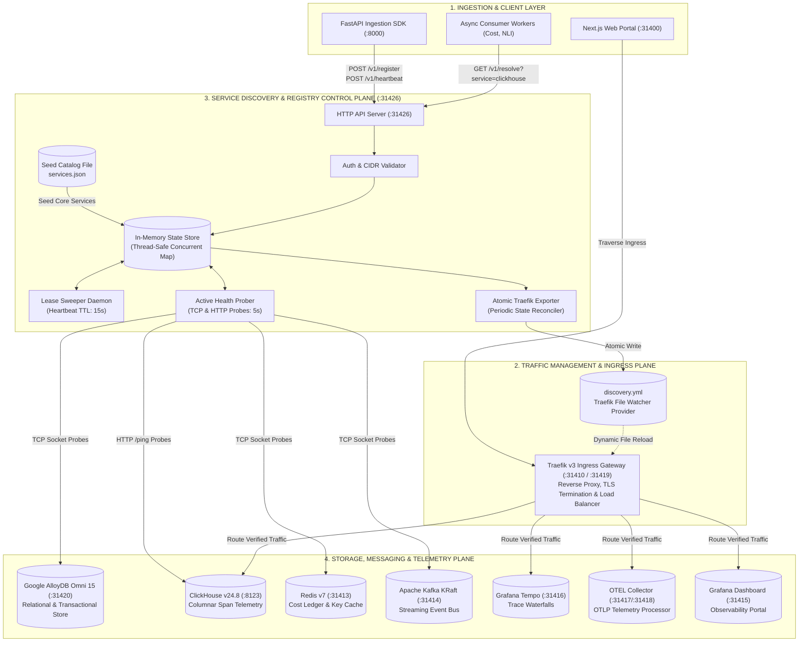
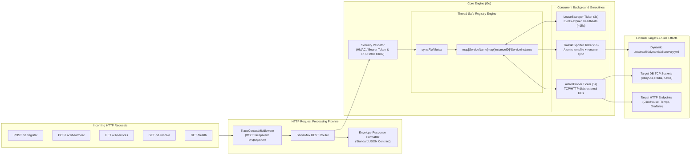
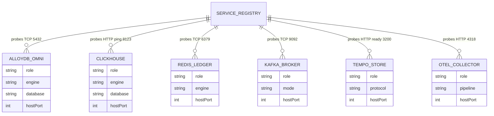
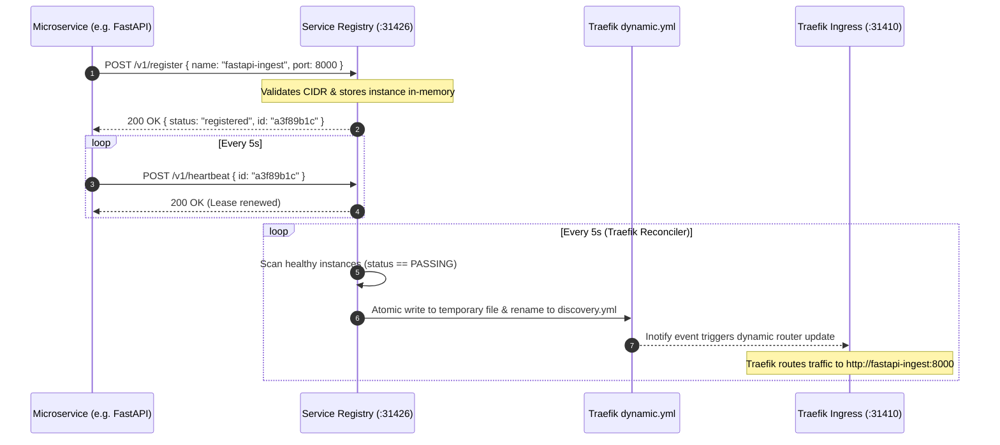

# LLM Service Discovery & Dynamic Registry Engine

> **Repository**: `Chief-Strategist-J/llm-service-discovery`  
> **Image**: `chiefj/llmobs-service-registry:latest`  
> **Default Port**: `31426`  
> **Architecture Standard**: Standalone Go Micro-Service with In-Memory Dual-State Engine & Traefik v3 Dynamic Provider  

---

## 1. High-Level Design (HLD) Architecture

The **LLM Service Discovery & Registry Engine** operates as the authoritative central control-plane registry for non-Kubernetes, Docker Compose, and Bare-Metal edge topologies. It bridges microservice instance lifecycles with the Traefik v3 ingress gateway, coordinating health states across the core database, analytics, and messaging planes.



---

## 2. Low-Level Design (LLD) Component Architecture

The service discovery daemon is constructed with clean dependency injection, zero third-party framework overhead, and non-blocking asynchronous concurrency routines:



---

## 3. In-Memory Database & Data Model Specification

The engine uses a high-speed, thread-safe in-memory database protected by read-write mutex locks (`sync.RWMutex`). It maintains relational indexes between service names, instance identifiers, and dynamic health assessment records.

### 3.1 Core Entity Schemas

#### A. Service Instance Schema (`ServiceInstance`)
Represents an active or registered microservice instance in the cluster:

| Field Name | Go Type | JSON Key | Description | Example |
|---|---|---|---|---|
| `ID` | `string` | `id` | Unique 64-bit Hex hash of `service:host:port` | `"7f33432e3998184d"` |
| `Name` | `string` | `name` | Canonical service name identifier | `"alloydb"`, `"clickhouse"`, `"fastapi-ingest"` |
| `Host` | `string` | `host` | IP address or internal Docker hostname | `"llmobs-alloydb"`, `"172.28.0.20"` |
| `Port` | `int` | `port` | Destination network port | `31420`, `8123`, `6379` |
| `Protocol` | `string` | `protocol` | Network transport protocol (`"http"`, `"https"`, `"tcp"`) | `"tcp"`, `"http"` |
| `Weight` | `int` | `weight` | Traffic distribution weight (1–100) | `100` |
| `Status` | `ServiceStatus` | `status` | Operational status (`0=UNKNOWN`, `1=PASSING`, `2=CRITICAL`) | `1` |
| `HealthCheck` | `HealthCheckConfig` | `healthCheck` | Active health check configuration | Embedded struct |
| `Metadata` | `map[string]string` | `metadata` | Arbitrary key-value labels and attributes | `{"source": "seed-catalog"}` |
| `RegisteredAt` | `time.Time` | `registeredAt` | Registration ISO 8601 timestamp | `"2026-09-06T09:34:24Z"` |
| `LastHeartbeat` | `time.Time` | `lastHeartbeat` | Last received keepalive heartbeat | `"2026-09-06T09:35:10Z"` |
| `LastProbeAt` | `time.Time` | `lastProbeAt` | Last active health check attempt | `"2026-09-06T09:35:12Z"` |
| `LastProbeErr` | `string` | `lastProbeErr` | Socket dial or HTTP non-200 error details | `"dial tcp: connection refused"` |
| `ConsecutiveFails` | `int` | `consecutiveFails` | Counter of successive failed probes | `0` (Critical threshold: ≥3) |
| `ConsecutiveSuccesses` | `int` | `consecutiveSuccesses` | Counter of successive passing probes | `5` (Healthy threshold: ≥2) |

#### B. HealthCheck Configuration Schema (`HealthCheckConfig`)

| Field Name | Go Type | JSON Key | Description | Default |
|---|---|---|---|---|
| `Protocol` | `string` | `protocol` | Protocol type: `"http"` or `"tcp"` | `"tcp"` |
| `Path` | `string` | `path` | HTTP health endpoint path | `"/health"` or `"/ping"` |
| `Interval` | `time.Duration` | `interval` | Polling frequency duration in nanoseconds | `5000000000` (5s) |
| `Timeout` | `time.Duration` | `timeout` | Socket / HTTP response timeout in nanoseconds | `2000000000` (2s) |

#### C. Lifecycle Status State Machine

```
              ┌──────────────────────────────────────────────┐
              │                                              │
              ▼                                              │
    [ UNKNOWN (0) ] ──(Probe Success >= 2)──► [ PASSING (1) ]
           │                                         │
           │                                         │
     (Probe Fail >= 3                          (Probe Fail >= 3
      or Heartbeat > 15s)                       or Heartbeat > 15s)
           │                                         │
           ▼                                         ▼
    [ CRITICAL (2) ] ◄───────────────────────────────┘
           │
           │ (Eviction after 60s in CRITICAL)
           ▼
    [ PURGED FROM MEMORY ]
```

---

## 4. Integration with Platform Databases & Infrastructure

The service registry monitors availability across all core databases and streaming components in the observability platform.

### 4.1 Storage & Infrastructure Relationship Diagram



### 4.2 Seed Catalog Platform Datastores Matrix

| Service Name | Host Container | Host Port | Internal Port | Protocol | Probe Check | Storage Engine & Role |
|---|---|---|---|---|---|---|
| `alloydb` | `llmobs-alloydb` | `31420` | `5432` | `tcp` | TCP Socket Connect | **Google Cloud AlloyDB Omni 15**: Relational transactional metadata (`organizations`, `tenants`, `api_keys`) |
| `clickhouse` | `llmobs-clickhouse` | `8123` | `8123` | `http` | `GET /ping` | **ClickHouse 24.8 Alpine**: Columnar high-speed span telemetry and log analytics |
| `redis` | `llmobs-redis` | `31413` | `6379` | `tcp` | TCP Socket Connect | **Redis 7 Alpine**: Micro-USD financial spend ledger & API key permission cache |
| `kafka` | `llmobs-kafka` | `31414` | `9092` | `tcp` | TCP Socket Connect | **Apache Kafka (KRaft)**: Real-time telemetry event streaming (`llm.spans.raw`, `llm.evaluations.queue`) |
| `tempo` | `llmobs-tempo` | `31416` | `3200` | `http` | `GET /ready` | **Grafana Tempo**: Distributed trace waterfall storage engine |
| `otel-collector` | `llmobs-otel-collector`| `31417` | `4318` | `http` | `GET /` | **OpenTelemetry Contrib**: OTLP attribute enrichment & batch ingestion pipeline |
| `grafana` | `llmobs-grafana` | `31415` | `3000` | `http` | `GET /api/health` | **Grafana Latest**: Unified platform analytics dashboards & tracing visualization |

---

## 5. Competitive Analysis: LLM Service Discovery vs. HashiCorp Consul

The table below contrasts our custom **LLM Service Discovery** engine against industry-standard **HashiCorp Consul**:

| Dimension | LLM Service Discovery Engine | HashiCorp Consul | Engineering & Business Impact |
|---|---|---|---|
| **Binary & Container Size** | **13.7 MB** (Compressed: 5.8 MB) | ~150 MB (Compressed: ~55 MB) | **90% reduction** in container footprint and image transfer times |
| **Idle Memory Consumption** | **12 MB – 20 MB** RAM | 100 MB – 250 MB RAM | Essential for edge nodes, CI runners, and memory-constrained developer workstations |
| **Startup & Boot Latency** | **< 50 milliseconds** | 3 – 8 seconds (Raft leader election) | Instant cold starts; zero waiting for cluster quorum in local dev or edge restarts |
| **Traefik Ingress Integration** | **Direct atomic file reconciler** (`discovery.yml`) | External Catalog API polling or Consul Connect mesh | No catalog polling overhead or complex Consul Connect sidecar proxies required |
| **Consensus & Clustering** | In-Memory Single-Process with LKG Client Cache | Multi-Node Raft Distributed Consensus | Consul is built for multi-datacenter HA; LLM Service Discovery is optimized for Docker Compose/Edge |
| **Active Probing Model** | Direct TCP & HTTP socket dials with backoff | Script checks, HTTP, gRPC, Docker exec, TCP | LLM Service Discovery rejects arbitrary `exec` to eliminate RCE vulnerabilities |
| **Configuration Complexity** | Zero-config / single `services.json` catalog | Multi-file HCL configs, gossip encryption keys, ACL tokens | Developers can boot the entire stack with zero configuration burden |
| **Operational Overhead** | Zero daemon maintenance | Requires Raft snapshotting, tombstone cleanups, and quorum monitoring | Eliminates distributed systems operational toil in non-Kubernetes environments |

---

## 6. SWOT Analysis

A comprehensive strategic assessment of the LLM Service Discovery Architecture:

| Category | Assessment | Strategic Response / Mitigation |
|---|---|---|
| **Strengths (S)** | • **Ultra-lightweight**: 13.7 MB Docker image with <20 MB memory footprint.<br/>• **Sub-second cold-starts**: Instant initialization with zero cluster consensus delay.<br/>• **Hardened security**: Banned arbitrary `exec` checks, enforced RFC 1918 CIDR validation.<br/>• **Seamless Traefik integration**: Built-in atomic `discovery.yml` reconciler.<br/>• **Deterministic seed catalog**: Guarantees boot-time readiness for platform databases. | Leverage as the default lightweight control plane across edge deployments, developer environments, and standalone Docker Compose stacks. |
| **Weaknesses (W)** | • **Single-Process In-Memory State**: Restarting the registry wipes dynamically registered microservices until they renew heartbeat.<br/>• **No Built-in Multi-Node Raft**: Does not natively support multi-datacenter quorum replication.<br/>• **No Native Web GUI**: Monitoring currently relies on REST endpoints (`/v1/services`, `/health`). | • Client-side Last-Known-Good (LKG) caching mitigates cold restarts.<br/>• Native Traefik dashboard visualizes routing state.<br/>• Roadmap v3.5 introduces embedded Web UI. |
| **Opportunities (O)** | • **Edge & IoT Telemetry Topologies**: Perfect fit for distributed resource-constrained edge gateways where Consul or K8s is too heavy.<br/>• **Embedded DNS Forwarding**: Adding a built-in DNS server (port 53) allows native `*.llmobs.local` resolution for all containers without Traefik.<br/>• **Native OTel Instrumentation**: Emitting registration events and probe latencies directly to OTEL Collector as span waterfalls. | Implement DNS forwarding (v3.4) and OTel span export (v3.6) to position the package as the premier edge discovery daemon. |
| **Threats (T)** | • **Kubernetes Redundancy**: In K8s environments, native `Service` and `EndpointSlice` primitives render custom registries redundant.<br/>• **Docker DNS Adoption**: Simple deployments might prefer Docker's internal DNS without dynamic weighting or active health probing. | Enforce clear environment boundaries: Registry is scoped strictly to Docker Compose and Edge topologies; bypassed cleanly in Kubernetes. |

---

## 7. Upcoming Feature Roadmap

The engineering roadmap for upcoming releases of `llm-service-discovery`:

| Milestone | Feature Name | Description | Target Benefit |
|---|---|---|---|
| **v3.2.0** | **gRPC Active Health Probing & mTLS** | Support native gRPC health checking (`grpc.health.v1.Health`) and mutual TLS certificate validation. | Enables secure inter-service probing for gRPC microservices and OTLP collectors. |
| **v3.3.0** | **Lightweight Raft HA Clustering** | Embed HashiCorp Raft to allow 3-node HA deployment with leader election and state replication. | High-availability active-passive failover for enterprise bare-metal clusters without Consul. |
| **v3.4.0** | **Embedded DNS Server (:53)** | Built-in lightweight DNS resolver responding to `A` and `SRV` queries for registered instances. | Containers can resolve `curl http://clickhouse.llmobs.local:8123` natively via Docker DNS forwarder. |
| **v3.5.0** | **Embedded Web Status Dashboard** | Lightweight HTML5/WebSockets admin portal on `:31426/ui` displaying real-time instance health and latency. | Instant operational visibility into cluster topology without opening CLI or querying raw JSON. |
| **v3.6.0** | **OTLP Trace Waterfall Export** | Native OpenTelemetry trace exporter pushing probe latencies and lease expirations to `llmobs-tempo`. | End-to-end visibility into service flapping and network degraded states in Grafana. |
| **v3.7.0** | **Dynamic Canary & Traffic Weight Splitting**| Real-time HTTP API to adjust service instance weights (`0–100`) dynamically synced into Traefik. | Enables zero-downtime blue-green and canary deployments across microservices. |

---

## 8. End-to-End Dynamic Traefik Sync Sequence



---

## 9. REST API Reference

All responses follow the unified envelope format:
```json
{
  "success": true,
  "statusCode": 200,
  "data": { ... },
  "meta": {
    "requestId": "req-1788687299-abc",
    "timestamp": "2026-09-06T09:34:59.086Z"
  }
}
```

### 1. Health Status
- **Endpoint**: `GET /health`
- **Response**:
```json
{
  "success": true,
  "statusCode": 200,
  "data": { "status": "healthy", "time": "2026-09-06T09:34:59Z" }
}
```

### 2. List All Services
- **Endpoint**: `GET /v1/services`
- **Response**: Dictionary mapping service names to arrays of `ServiceInstance` records.

### 3. Resolve Active Service
- **Endpoint**: `GET /v1/resolve?service={name}`
- **Response**: Returns a healthy instance endpoint with optimal weight.

### 4. Register Instance
- **Endpoint**: `POST /v1/register`
- **Body**:
```json
{
  "name": "python-nli-worker",
  "host": "llmobs-nli-worker",
  "port": 8090,
  "protocol": "http",
  "weight": 100,
  "healthCheck": {
    "protocol": "http",
    "path": "/health",
    "interval": 5000000000,
    "timeout": 2000000000
  }
}
```

### 5. Send Heartbeat
- **Endpoint**: `POST /v1/heartbeat`
- **Body**:
```json
{
  "id": "7f33432e3998184d"
}
```

---

## 10. Deployment & Environment Configuration

### Docker Compose Integration
```yaml
  llmobs-service-registry:
    image: chiefj/llmobs-service-registry:latest
    container_name: llmobs-service-registry
    restart: always
    ports:
      - "31426:31426"
    environment:
      - CONFIG_PATH=/etc/service-registry/config.json
      - CATALOG_PATH=/etc/service-registry/services.json
      - OTEL_SERVICE_NAME=llmobs-service-registry
      - OTEL_EXPORTER_OTLP_ENDPOINT=http://llmobs-otel-collector:4318
    volumes:
      - ./config/service-registry:/etc/service-registry:ro
      - ./config/traefik/dynamic:/etc/traefik/dynamic
    networks:
      - llmobs-network
    healthcheck:
      test: ["CMD-SHELL", "wget --no-verbose --spider http://localhost:31426/health || exit 1"]
      interval: 5s
      timeout: 3s
      retries: 5
```

### Environment Variables Matrix

| Variable | Default Value | Description |
|---|---|---|
| `PORT` | `31426` | TCP listening port for the HTTP REST server |
| `CONFIG_PATH` | `/etc/service-registry/config.json` | Path to server security, CIDR, and lease timeouts configuration |
| `CATALOG_PATH` | `/etc/service-registry/services.json` | Path to static seed catalog for boot-time dependencies |
| `OTEL_SERVICE_NAME` | `llmobs-service-registry` | OpenTelemetry distributed tracing service name identifier |
| `OTEL_EXPORTER_OTLP_ENDPOINT`| `http://llmobs-otel-collector:4318`| Endpoint to push OTLP HTTP trace waterfall spans |
