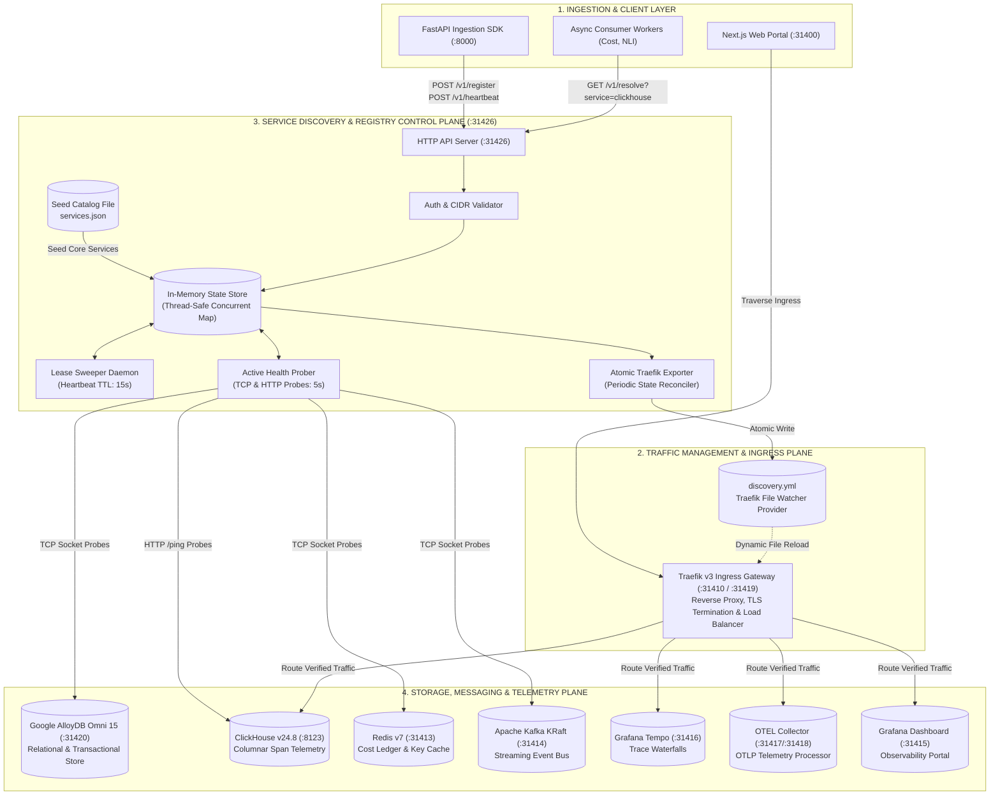
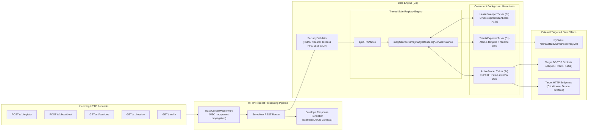
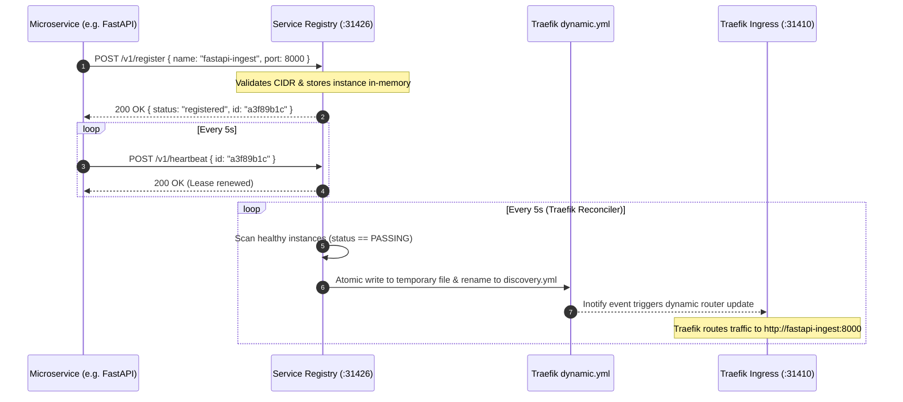

# LLM Service Discovery & Dynamic Registry Engine

> **Repository**: `Chief-Strategist-J/llm-service-discovery`  
> **Image**: `chiefj/llmobs-service-registry:latest`  
> **Default Port**: `31426`  
> **Architecture Standard**: Standalone Go Micro-Service with In-Memory Dual-State Engine & Traefik v3 Dynamic Provider  

---

## 1. High-Level Design (HLD) Architecture

The **LLM Service Discovery & Registry Engine** operates as the authoritative central control-plane registry for non-Kubernetes, Docker Compose, and Bare-Metal edge topologies. It bridges microservice instance lifecycles with the Traefik v3 ingress gateway, coordinating health states across the core database, analytics, and messaging planes.



---

## 2. Low-Level Design (LLD) Component Architecture

The service discovery daemon is constructed with clean dependency injection, zero third-party framework overhead, and non-blocking asynchronous concurrency routines:



---

## 3. In-Memory Database & Data Model Specification

The engine uses a high-speed, thread-safe in-memory database protected by read-write mutex locks (`sync.RWMutex`). It maintains relational indexes between service names, instance identifiers, and dynamic health assessment records.

### 3.1 Core Entity Schemas

#### A. Service Instance Schema (`ServiceInstance`)
Represents an active or registered microservice instance in the cluster:

| Field Name | Type | Description | Example |
|---|---|---|---|
| `id` | `string` | Unique 64-bit Hex hash of `service:host:port` | `"7f33432e3998184d"` |
| `name` | `string` | Canonical service name identifier | `"alloydb"`, `"clickhouse"`, `"fastapi-ingest"` |
| `host` | `string` | IP address or internal Docker hostname | `"llmobs-alloydb"`, `"172.28.0.20"` |
| `port` | `int` | Destination network port | `31420`, `8123`, `6379` |
| `protocol` | `string` | Network transport protocol (`"http"`, `"https"`, `"tcp"`) | `"tcp"`, `"http"` |
| `weight` | `int` | Traffic distribution weight (1–100) | `100` |
| `status` | `ServiceStatus` | Instance operational status (`0=UNKNOWN`, `1=PASSING`, `2=CRITICAL`) | `1` |
| `healthCheck` | `HealthCheckConfig` | Embedded probing configuration | *See HealthCheck schema below* |
| `metadata` | `map[string]string` | Arbitrary key-value labels and attributes | `{"source": "seed-catalog", "version": "15"}` |
| `registeredAt` | `time.Time` | ISO 8601 registration timestamp | `"2026-09-06T09:34:24Z"` |
| `lastHeartbeat` | `time.Time` | ISO 8601 last received keepalive heartbeat | `"2026-09-06T09:35:10Z"` |
| `lastProbeAt` | `time.Time` | ISO 8601 last active health check timestamp | `"2026-09-06T09:35:12Z"` |
| `lastProbeErr` | `string` | Last socket dial error or HTTP non-200 code | `""` or `"dial tcp: connection refused"` |
| `consecutiveFails` | `int` | Counter of successive failed probes | `0` (Critical threshold: ≥3) |
| `consecutiveSuccesses` | `int` | Counter of successive passing probes | `5` (Healthy threshold: ≥2) |

#### B. HealthCheck Configuration Schema (`HealthCheckConfig`)
Defines how the active probing engine verifies the target:

```go
type HealthCheckConfig struct {
    Protocol string        `json:"protocol"` // "http" or "tcp"
    Path     string        `json:"path"`     // e.g., "/health", "/ping" (HTTP only)
    Interval time.Duration `json:"interval"` // default: 5s
    Timeout  time.Duration `json:"timeout"`  // default: 2s
}
```

#### C. Lifecycle Status State Machine

```
              ┌──────────────────────────────────────────────┐
              │                                              │
              ▼                                              │
    [ UNKNOWN (0) ] ──(Probe Success >= 2)──► [ PASSING (1) ]
           │                                         │
           │                                         │
     (Probe Fail >= 3                          (Probe Fail >= 3
      or Heartbeat > 15s)                       or Heartbeat > 15s)
           │                                         │
           ▼                                         ▼
    [ CRITICAL (2) ] ◄───────────────────────────────┘
           │
           │ (Eviction after 60s in CRITICAL)
           ▼
    [ PURGED FROM MEMORY ]
```

---

## 4. Integration with Platform Databases & Infrastructure

The registry natively orchestrates readiness and availability tracking across all platform datastores configured in `services.json`:

```mermaid
erDiagram
    SERVICE-REGISTRY ||--o{ ALLOYDB-OMNI : "probes TCP :5432"
    SERVICE-REGISTRY ||--o{ CLICKHOUSE : "probes HTTP /ping :8123"
    SERVICE-REGISTRY ||--o{ REDIS-LEDGER : "probes TCP :6379"
    SERVICE-REGISTRY ||--o{ KAFKA-BROKER : "probes TCP :9092"
    SERVICE-REGISTRY ||--o{ TEMPO-STORE : "probes HTTP /ready :3200"
    SERVICE-REGISTRY ||--o{ OTEL-COLLECTOR : "probes HTTP / :4318"

    ALLOYDB-OMNI {
        string role "Transactional Relational Metadata"
        string engine "Google Cloud AlloyDB Omni 15"
        int port 31420
        string db "llm_observability"
    }

    CLICKHOUSE {
        string role "Columnar Analytics & Telemetry Spans"
        string engine "ClickHouse 24.8 Alpine"
        int port 8123
        string db "llm_telemetry_analytics"
    }

    REDIS-LEDGER {
        string role "Micro-USD Financial Cost Ledger"
        string engine "Redis 7 Alpine"
        int port 31413
    }
```

### Seed Catalog Definition (`config/service-registry/services.json`)
The registry bootstraps immediately with seed services so the cluster can boot deterministically:

```json
[
  {
    "name": "alloydb",
    "host": "llmobs-alloydb",
    "port": 5432,
    "protocol": "tcp",
    "weight": 100,
    "healthCheck": { "protocol": "tcp", "interval": 5000000000, "timeout": 2000000000 },
    "metadata": { "source": "seed-catalog" }
  },
  {
    "name": "clickhouse",
    "host": "llmobs-clickhouse",
    "port": 8123,
    "protocol": "http",
    "weight": 100,
    "healthCheck": { "protocol": "http", "path": "/ping", "interval": 5000000000, "timeout": 2000000000 },
    "metadata": { "source": "seed-catalog" }
  },
  {
    "name": "redis",
    "host": "llmobs-redis",
    "port": 6379,
    "protocol": "tcp",
    "weight": 100,
    "healthCheck": { "protocol": "tcp", "interval": 5000000000, "timeout": 2000000000 },
    "metadata": { "source": "seed-catalog" }
  }
]
```

---

## 5. End-to-End Dynamic Traefik Sync Workflow

Whenever services change status or are dynamically registered, the engine generates an atomic configuration for Traefik v3:



---

## 6. REST API Reference

All responses follow the unified envelope format:
```json
{
  "success": true,
  "statusCode": 200,
  "data": { ... },
  "meta": {
    "requestId": "req-1788687299-abc",
    "timestamp": "2026-09-06T09:34:59.086Z"
  }
}
```

### 1. Health Status
- **Endpoint**: `GET /health`
- **Response**:
```json
{
  "success": true,
  "statusCode": 200,
  "data": { "status": "healthy", "time": "2026-09-06T09:34:59Z" }
}
```

### 2. List All Services
- **Endpoint**: `GET /v1/services`
- **Response**: Dictionary mapping service names to arrays of `ServiceInstance` records.

### 3. Resolve Active Service
- **Endpoint**: `GET /v1/resolve?service={name}`
- **Response**: Returns a healthy instance endpoint with optimal weight.

### 4. Register Instance
- **Endpoint**: `POST /v1/register`
- **Body**:
```json
{
  "name": "python-nli-worker",
  "host": "llmobs-nli-worker",
  "port": 8090,
  "protocol": "http",
  "weight": 100,
  "healthCheck": {
    "protocol": "http",
    "path": "/health",
    "interval": 5000000000,
    "timeout": 2000000000
  }
}
```

### 5. Send Heartbeat
- **Endpoint**: `POST /v1/heartbeat`
- **Body**:
```json
{
  "id": "7f33432e3998184d"
}
```

---

## 7. Deployment & Environment Configuration

### Docker Compose Integration
```yaml
  llmobs-service-registry:
    image: chiefj/llmobs-service-registry:latest
    container_name: llmobs-service-registry
    restart: always
    ports:
      - "31426:31426"
    environment:
      - CONFIG_PATH=/etc/service-registry/config.json
      - CATALOG_PATH=/etc/service-registry/services.json
      - OTEL_SERVICE_NAME=llmobs-service-registry
      - OTEL_EXPORTER_OTLP_ENDPOINT=http://llmobs-otel-collector:4318
    volumes:
      - ./config/service-registry:/etc/service-registry:ro
      - ./config/traefik/dynamic:/etc/traefik/dynamic
    networks:
      - llmobs-network
    healthcheck:
      test: ["CMD-SHELL", "wget --no-verbose --spider http://localhost:31426/health || exit 1"]
      interval: 5s
      timeout: 3s
      retries: 5
```

### Environment Variables Matrix

| Variable | Default Value | Description |
|---|---|---|
| `PORT` | `31426` | TCP listening port for the HTTP REST server |
| `CONFIG_PATH` | `/etc/service-registry/config.json` | Path to server security, CIDR, and lease timeouts configuration |
| `CATALOG_PATH` | `/etc/service-registry/services.json` | Path to static seed catalog for boot-time dependencies |
| `OTEL_SERVICE_NAME` | `llmobs-service-registry` | OpenTelemetry distributed tracing service name identifier |
| `OTEL_EXPORTER_OTLP_ENDPOINT`| `http://llmobs-otel-collector:4318`| Endpoint to push OTLP HTTP trace waterfall spans |
